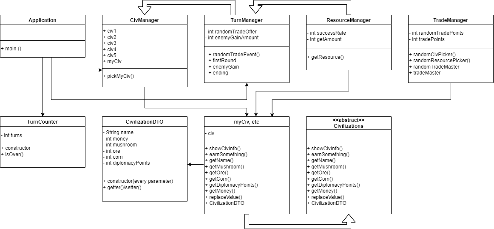

# 미니 문명 *Mini Civilizations*
다형성까지의 학습 범위를 총집합하여 만든 개인 프로젝트.

## 프로그램 요약
미리 준비된 다섯 가지의 문명 (한국, 브라질, 미국, 인도, 프랑스) 중 하나를 골라 시작한다. 이후 자원 개발과 거래로 보유 자금과 외교 점수를 쌓아 미리 지정한 턴 수 안에 1위를 차지하는 것이 목적인 게임.

## 요구사항
* 준비된 5개의 문명 중 한 문명을 고를 수 있다.
* 나라 내 자원을 개발할 수 있다.
    - 삼림 : 버섯을 얻는다.
    - 채광 : 광물을 얻는다.
    - 농사 : 옥수수를 얻는다.
* 다른 문명과 거래할 수 있다.
    - 특정 확률로 턴이 시작될 때 다른 문명에서 내 문명에게 거래를 요청한다.
        + 랜덤 발생 거래의 경우 승낙시 얻는 외교 점수가 더 높다.
        + 랜덤 발생 거래의 경우 거부시 희박한 확률로 페널티를 받는다. (ex. 외교 점수 하락, 핵이 날아와 게임 종료, etc.)
    - 거래를 행동의 일부로써 선택할 수 있다.
        + 거래 진행시 100% 확률로 정해진 보상과 외교 점수를 받는다.
        + 적은 확률로 추가 외교 점수 혹은 보상을 받는다.
    - 거래는 자원을 다른 나라에 판매해 자금을 얻고 다른 나라의 자금을 줄일 수 있는 선택지이다.
    - 턴 수를 지정할 수 있다.
        + 한 턴 안에서는 거래 1회 혹은 자원 개발 1회를 할 수 있다. 
    - 지정한 턴이 모두 끝나면 외교 점수와 보유 자금을 합해 최종 점수를 겨룬다.

## 커뮤니케이션 다이어그램

## 클래스 다이어그램
